# 🛡️ FASE 4: Security Baseline

**Obiettivo**: Integrare controlli di sicurezza fondamentali nel pipeline DevSecOps

## 📋 Overview

La FASE 4 estende la pipeline CI/CD della FASE 3 con controlli di sicurezza avanzati:

- **Dependency Scanning**: npm audit + Trivy per vulnerabilità
- **SAST**: SonarQube per analisi statica del codice  
- **DAST**: OWASP ZAP per test dinamici
- **Container Security**: Dockerfile hardening + scanning
- **Secrets Management**: Gestione sicura credenziali

## 🏗️ Architettura

```
📦 FASE 4: Security Baseline
├── 🚀 FASE 3: CI/CD Jenkins (ESTESA) ✅
│   ├── 🐳 FASE 2: Containerizzazione ✅  
│   └── 🔧 FASE 1: Validazione Base ✅
└── 🛡️ NEW: Security Controls
    ├── Dependency Scanning
    ├── SAST (Static Analysis)
    ├── DAST (Dynamic Analysis) 
    ├── Container Security
    └── Secrets Management
```

## 🔧 Security Tools

| Tool | Purpose | Integration |
|------|---------|-------------|
| **npm audit** | Dependency vulnerabilities | Pipeline stage |
| **Trivy** | Container image scanning | Docker build |
| **SonarQube** | Code quality & security | Jenkins plugin |
| **OWASP ZAP** | Web app security testing | Post-deploy |
| **Git-secrets** | Prevent secret commits | Pre-commit |

## 🚀 Quick Start

### 1. Setup FASE 4
```bash
# Vai nella home directory
cd ~

# Crea directory FASE 4
mkdir -p devops-pipeline-fase-4
cd devops-pipeline-fase-4

# Scarica lo script di sync
curl -o sync-devops-config.sh https://raw.githubusercontent.com/mcatania72/CRM-System/main/devops-pipeline-fase-4/sync-devops-config.sh
chmod +x sync-devops-config.sh

# Sincronizza tutto dalla FASE 4
./sync-devops-config.sh
```

### 2. Installa Security Tools
```bash
# Installa automaticamente tutti i tool di sicurezza
./prerequisites-security.sh
```

### 3. Deploy Security Pipeline
```bash
# Estende Jenkins con security stages
./deploy-security.sh start

# Verifica configurazione
./deploy-security.sh status
```

### 4. Test Security Compliance
```bash
# Test completi security + riutilizzo test FASE 1,2,3
./test-security.sh

# Test manuali guidati
./test-security.sh manual
```

## 🎯 Caratteristiche FASE 4

### 🔒 Security Scanning Completo
- ✅ **Dependency Check**: npm audit per vulnerabilità NPM
- ✅ **Container Scan**: Trivy per immagini Docker
- ✅ **Code Analysis**: SonarQube per code smells e security
- ✅ **Web App Test**: OWASP ZAP per test dinamici
- ✅ **Secret Detection**: git-secrets per credenziali

### 🔄 Pipeline Integration
- ✅ **Jenkins Extension**: Nuovi stage nella pipeline esistente
- ✅ **Security Gates**: Blocco build se vulnerabilità critiche
- ✅ **Reporting**: Dashboard security con metriche
- ✅ **Notifications**: Alert per security findings
- ✅ **Automation**: Fix automatici dove possibile

### 🧪 Test Suite Ibrido
- ✅ **Security Tests**: Compliance OWASP Top 10
- ✅ **Performance Tests**: Impact dei controlli security
- ✅ **Integration Tests**: Riutilizzo completo FASE 1,2,3
- ✅ **Regression Tests**: Verifica non-breaking changes

## 🏆 Obiettivi FASE 4

### ✅ Criterio Minimo (80%+)
- Security tools installati e configurati
- Pipeline security integrata 
- Dependency scanning funzionante
- Basic container hardening

### 🔥 Criterio Ottimale (95%+)
- Zero vulnerabilità critiche
- SAST completo integrato
- DAST automatizzato
- Security reporting dashboard
- Automated remediation

## 📊 Security Coverage

| OWASP Top 10 | Coverage | Tools |
|--------------|----------|-------|
| A01: Broken Access Control | ✅ | SAST, Manual review |
| A02: Cryptographic Failures | ✅ | npm audit, Code review |
| A03: Injection | ✅ | SAST, DAST |
| A04: Insecure Design | ⚠️ | Architecture review |
| A05: Security Misconfiguration | ✅ | Container scan, DAST |
| A06: Vulnerable Components | ✅ | npm audit, Trivy |
| A07: Authentication Failures | ✅ | SAST, DAST |
| A08: Software Integrity | ✅ | Container scan, SAST |
| A09: Logging Failures | ⚠️ | Code review, SAST |
| A10: SSRF | ✅ | SAST, DAST |

**Security Coverage: ~85%** - Eccellente baseline enterprise

## 🔄 Workflow Security

```mermaid
graph LR
    A[Git Push] --> B[Checkout]
    B --> C[Dependencies Scan]
    C --> D[Build]
    D --> E[SAST Analysis]
    E --> F[Container Build]
    F --> G[Container Scan]
    G --> H[Deploy]
    H --> I[DAST Testing]
    I --> J[Security Report]
    J --> K[Security Gates]
    K --> L[Production Ready]
```



## 🛠️ Tools Configurati

### SonarQube Community
- **Port**: 9000
- **Dashboard**: http://localhost:9000
- **Integration**: Jenkins plugin
- **Rules**: Security + Quality gates

### OWASP ZAP
- **Mode**: Headless automation
- **Scans**: Baseline + Active 
- **Reports**: HTML + JSON
- **Integration**: Post-deployment

### Trivy Scanner
- **Targets**: Container images
- **Databases**: Updated daily
- **Output**: JSON + Table
- **Integration**: Docker build stage

## 🚀 Prossimi Passi

Una volta completata la FASE 4 al 85%+:

- **FASE 5**: Kubernetes Orchestration + Security
- **FASE 6**: Infrastructure as Code + Compliance
- **Advanced Security**: WAF, SIEM, 24/7 monitoring

## 📞 Support

Per troubleshooting o domande sulla FASE 4:
1. Controlla i log di deployment
2. Verifica prerequisiti installati
3. Usa `./test-security.sh debug` per diagnostica

---

**🏆 FASE 4 = Security Baseline per Production-Ready Applications**